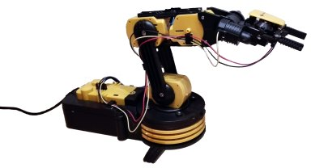

# Robotic Arm Tools
This is a library and some examples using it for a robotic arm.

## Library

* arm.py
  * The library to control the arm.
* recorder.py
  * The library to record sequences of movement of the arm and to play them forward and backward.

## Examles

* gui.py
  * A desktop application to control the arm based on gtk.
* web.py
  * A web application to control the arm based on flask.
  * Optional video feed provided by camera.py
* wii.py
  *  Control the arm using a wii-mote.
